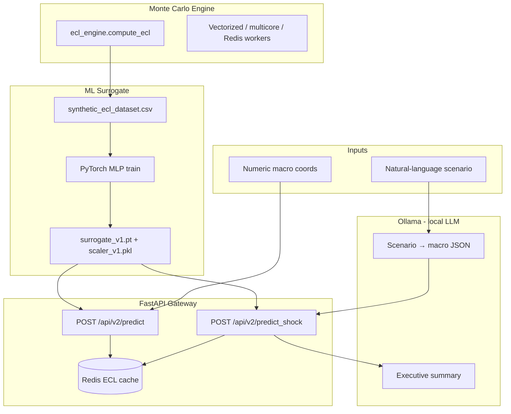

# Monte Carlo Expected Credit Loss Simulator with PyTorch Neural Surrogate

A quantitative credit-risk system that forecasts **Expected Credit Loss (ECL)** on large loan portfolios under macroeconomic stress. It combines:

- **Monte Carlo simulation** (vectorized NumPy, multi-core, and Redis-distributed workers)
- A **PyTorch neural surrogate** that approximates the simulator in milliseconds
- A **FastAPI gateway** with optional **Ollama** (free, local LLM) for natural-language stress scenarios and executive reports
- **Redis caching** for repeated inference requests

The original TypeScript prototype (branch `v1-typescript-prototype`) validated core PD/LGD math. This branch adds Python vectorization, distributed execution, ML acceleration, and an agent layer for plain-English scenario testing.

---

## Table of contents

1. [Architecture](#architecture)
2. [Project layout](#project-layout)
3. [Prerequisites](#prerequisites)
4. [Installation](#installation)
5. [Quick start](#quick-start)
6. [Monte Carlo simulation engine](#monte-carlo-simulation-engine)
7. [ML surrogate pipeline](#ml-surrogate-pipeline)
8. [REST API reference](#rest-api-reference)
9. [Ollama (local LLM)](#ollama-local-llm)
10. [Redis: job queue vs ECL cache](#redis-job-queue-vs-ecl-cache)
11. [Docker](#docker)
12. [Testing & validation](#testing--validation)
13. [Configuration reference](#configuration-reference)
14. [Troubleshooting](#troubleshooting)
15. [Development notes](#development-notes)

---

## Architecture



**Data flow summary**

| Stage | What happens |
|-------|--------------|
| **Label generation** | Sample macro scenarios → run Monte Carlo `compute_ecl()` → write CSV |
| **Training** | Train a 3→64→32→1 MLP with feature + label scaling → save artifacts to `models/` |
| **Numeric inference** | Clip macro inputs → scale → forward pass → inverse-scale → ECL in ~1 ms |
| **Shock inference** | Ollama translates scenario text → same surrogate → Ollama writes report |
| **Caching** | Identical macro coords hit Redis (`ecl_cache:*`) for 24 h, skipping the model |

---

## Project layout

```
.
├── data/                              # Generated datasets (CSV gitignored)
│   └── synthetic_ecl_dataset.csv
├── models/                            # Trained artifacts (gitignored)
│   ├── surrogate_v1.pt                # PyTorch weights
│   └── scaler_v1.pkl                # Feature + label StandardScalers
├── results/                           # Simulation output text files
│   ├── naive_results.txt
│   ├── vectorized_results.txt
│   ├── multicore_results.txt
│   ├── redis_results.txt
│   └── all_results.txt
├── scripts/
│   ├── validate_pipeline.py           # End-to-end smoke test
│   ├── validate_pipeline.ps1          # Windows: pytest + pipeline
│   └── validate_pipeline.sh           # Bash equivalent
├── src/risk_engine/                   # Main installable Python package
│   ├── config.py                      # .env loading, path constants, bounds
│   ├── monte_carlo/                   # Core ECL engine + simulators
│   │   ├── ecl_engine.py              # macro → hazard → PD → ECL
│   │   ├── loop_calc.py               # Naive Python loop (baseline)
│   │   ├── vectorized_calc.py         # NumPy vectorized (fast)
│   │   ├── multicore_calc.py          # ProcessPoolExecutor parallel
│   │   └── run_all.py                 # Run all three + merge results
│   ├── queue/                         # Redis distributed simulation
│   │   ├── consumer.py                # Worker: pops jobs, runs chunks
│   │   └── producer.py                # Pushes jobs, collects results
│   ├── surrogate/                     # ML surrogate + API + LLM agent
│   │   ├── app.py                     # FastAPI application
│   │   ├── model.py                   # ECLSurrogate MLP definition
│   │   ├── generate_training_data.py  # Monte Carlo → CSV labels
│   │   ├── validate_dataset.py        # Dataset quality checks
│   │   ├── train.py                   # Training loop + early stopping
│   │   ├── evaluate.py                # Validation gates + spot-checks
│   │   ├── inference.py               # Load model, predict ECL
│   │   ├── cache.py                   # Redis ECL prediction cache
│   │   ├── agentic_translator.py      # Scenario text → macro coords
│   │   ├── report_synthesizer.py      # Macro + ECL → executive summary
│   │   ├── llm_client.py              # Ollama HTTP client
│   │   ├── prompts.py                 # LLM system/user prompts
│   │   ├── schemas.py                 # Pydantic API request/response models
│   │   ├── sampling.py                # Latin hypercube macro sampling
│   │   ├── dataset.py                 # PyTorch Dataset wrapper
│   │   └── scalers.py                 # Feature/label scaler I/O
│   └── testing/                       # Shared test doubles
│       └── fakes.py                   # FakeRedis for unit tests
├── tests/
│   ├── conftest.py                    # Shared pytest fixtures
│   ├── unit/                          # Fast tests (no external services)
│   └── integration/                   # API TestClient + live Redis
├── docker-compose.yml
├── Dockerfile
├── pyproject.toml
└── .env.example
```

---

## Prerequisites

| Requirement | Version / notes |
|-------------|-----------------|
| **Python** | 3.13 or 3.14 (`>=3.13,<3.15` — required by PyTorch) |
| **Poetry** | Latest — [install guide](https://python-poetry.org/docs/#installation) |
| **Redis** | Optional locally; included in Docker Compose |
| **Ollama** | Optional — free local LLM for `/predict_shock` |
| **Docker Desktop** | Optional — for containerized Redis, workers, and API |

---

## Installation

From the project root:

```bash
# Clone and enter the repo (from the project root)
cd monte-carlo-ecl-simulator-pytorch-surrogate

# Install dependencies + the risk_engine package
poetry install

# Create your local config
cp .env.example .env   # Windows: copy .env.example .env
```

`poetry install` registers the `risk_engine` package (Poetry project: `monte-carlo-ecl-simulator-pytorch-surrogate`). All commands below use `python -m risk_engine...` — no manual `PYTHONPATH` setup required.

**Optional:** activate the virtual environment to drop the `poetry run` prefix:

```bash
poetry shell
python -m risk_engine.monte_carlo.vectorized_calc
```

---

## Quick start

### Option A — Full ML pipeline (recommended first run)

```bash
# 1. Generate 1000 labeled scenarios (~few minutes with default N_LOANS)
poetry run python -m risk_engine.surrogate.generate_training_data

# 2. Train the surrogate
poetry run python -m risk_engine.surrogate.train

# 3. Verify model quality (must pass MAE < 5% gate)
poetry run python -m risk_engine.surrogate.evaluate

# 4. Start the API
poetry run uvicorn risk_engine.surrogate.app:app --app-dir src --reload --port 8080
```

Open **http://localhost:8080/docs** and try `POST /api/v2/predict` with:

```json
{
  "unemployment_rate": 6.5,
  "interest_rate": 5.25,
  "housing_price_index": 95.0
}
```

### Option B — Monte Carlo simulation only

```bash
# Fast vectorized run (override portfolio size for quick test)
poetry run python -m risk_engine.monte_carlo.vectorized_calc --n-loans 1000000
```

Results are written to `results/vectorized_results.txt`.

### Option C — One-command validation

```bash
# Runs pytest + full generate → train → evaluate → API smoke test
poetry run python scripts/validate_pipeline.py

# Windows wrapper (pytest + pipeline)
./scripts/validate_pipeline.ps1
```

---

## Monte Carlo simulation engine

The core function is `risk_engine.monte_carlo.ecl_engine.compute_ecl()`:

```
macro inputs → hazard rate → PD = 1 - exp(-hazard × horizon)
             → Monte Carlo default count → ECL = defaults × AVG_EXPOSURE × LGD
```

**Macro features**

| Feature | Baseline | Effect on credit risk |
|---------|----------|----------------------|
| `unemployment_rate` | 4.0% | Higher → higher hazard |
| `interest_rate` | 3.0% | Higher → higher hazard |
| `housing_price_index` | 100.0 | Lower → higher hazard |

At baseline values, hazard rate equals `BASE_HAZARD_RATE` (default 5%).

### Simulation runners

All runners accept `--n-loans` to override `N_LOANS` from `.env`.

| Module | Command | Speed | Output file |
|--------|---------|-------|-------------|
| Naive loop | `python -m risk_engine.monte_carlo.loop_calc` | Slowest (baseline) | `results/naive_results.txt` |
| Vectorized | `python -m risk_engine.monte_carlo.vectorized_calc` | Fast (NumPy) | `results/vectorized_results.txt` |
| Multicore | `python -m risk_engine.monte_carlo.multicore_calc` | Parallel CPU cores | `results/multicore_results.txt` |
| All three | `python -m risk_engine.monte_carlo.run_all` | Runs all + merges | `results/all_results.txt` |

**Example — quick local test:**

```bash
poetry run python -m risk_engine.monte_carlo.vectorized_calc --n-loans 50000
```

### Distributed simulation (Redis queue)

Split a large portfolio across Redis workers:

```bash
# Terminal 1 — start worker(s)
poetry run python -m risk_engine.queue.consumer

# Terminal 2 — push jobs and collect results
poetry run python -m risk_engine.queue.producer
```

The producer splits `N_LOANS` into `N_JOBS` chunks (default 10), pushes them to the `simulation_jobs` queue, waits for `simulation_results`, and writes `results/redis_results.txt`.

---

## ML surrogate pipeline

The surrogate learns to approximate `compute_ecl()` from three macro inputs. Training labels come from the real Monte Carlo engine — not synthetic guesses.

### Step-by-step

#### 1. Generate training data

```bash
poetry run python -m risk_engine.surrogate.generate_training_data \
  --n-samples 1000 \
  --n-loans 500000 \
  --seed 42 \
  --method latin_hypercube
```

| Flag | Default | Description |
|------|---------|-------------|
| `--n-samples` | `1000` | Number of macro scenarios |
| `--n-loans` | `500000` | Loans per label simulation |
| `--output` | `data/synthetic_ecl_dataset.csv` | Output CSV path |
| `--seed` | `42` | Reproducibility seed |
| `--method` | `latin_hypercube` | `latin_hypercube` or `uniform` |

**Output schema:** `unemployment_rate`, `interest_rate`, `housing_price_index`, `expected_credit_loss`

#### 2. Validate dataset

```bash
poetry run python -m risk_engine.surrogate.validate_dataset \
  --input data/synthetic_ecl_dataset.csv \
  --expected-rows 1000 \
  --n-loans 500000
```

Checks row count, NaNs, feature ranges, label distribution, and spot-checks rows against `compute_ecl()`.

#### 3. Train

```bash
poetry run python -m risk_engine.surrogate.train \
  --epochs 500 \
  --batch-size 32 \
  --patience 30
```

| Flag | Default | Description |
|------|---------|-------------|
| `--dataset` | `data/synthetic_ecl_dataset.csv` | Training CSV |
| `--model-out` | `models/surrogate_v1.pt` | Model weights output |
| `--scaler-out` | `models/scaler_v1.pkl` | Scaler artifact output |
| `--epochs` | `500` | Max training epochs |
| `--batch-size` | `32` | Mini-batch size |
| `--lr` | `0.001` | Learning rate |
| `--patience` | `30` | Early stopping patience |
| `--seed` | `42` | Random seed |

**Model architecture:** MLP `3 → 64 → 32 → 1` with ReLU activations. Both feature and label `StandardScaler` are saved (label scaling is critical for billion-scale ECL values).

#### 4. Evaluate

```bash
poetry run python -m risk_engine.surrogate.evaluate
```

Validation gates (must pass before deploying):

| Gate | Default threshold | What it checks |
|------|-------------------|----------------|
| Val MAE ratio | < 5% (`EVAL_MAE_THRESHOLD`) | Mean absolute error vs mean ECL |
| Spot-checks | < 10% error (`EVAL_SPOT_CHECK_TOLERANCE`) | Random rows vs live `compute_ecl()` |

Typical production result: **~0.45% val MAE ratio**.

#### 5. CLI inference (without API)

```bash
poetry run python -m risk_engine.surrogate.inference \
  --unemployment 6.5 --interest 5.25 --hpi 95
```

#### 6. Start API

```bash
poetry run uvicorn risk_engine.surrogate.app:app --app-dir src --reload --port 8080
```

Requires `models/surrogate_v1.pt` and `models/scaler_v1.pkl` to exist.

---

## REST API reference

Base URL: **http://localhost:8080**

Interactive docs: **http://localhost:8080/docs** (Swagger UI)

### `GET /health`

Returns service status and Redis cache availability.

**Response:**

```json
{
  "status": "ok",
  "cache_enabled": true,
  "cache_available": true
}
```

`cache_available: false` means Redis is unreachable — the API still works, just without caching.

---

### `POST /api/v2/predict`

Predict portfolio ECL from numeric macro coordinates.

**Request body:**

```json
{
  "unemployment_rate": 6.5,
  "interest_rate": 5.25,
  "housing_price_index": 95.0
}
```

| Field | Type | Valid range (default) |
|-------|------|----------------------|
| `unemployment_rate` | float | 2.0 – 15.0 (percent) |
| `interest_rate` | float | 0.0 – 12.0 (percent) |
| `housing_price_index` | float | 70.0 – 130.0 (index level) |

**Response:**

```json
{
  "input_macro_coordinates": {
    "unemployment_rate": 6.5,
    "interest_rate": 5.25,
    "housing_price_index": 95.0
  },
  "predicted_ecl": 4307526656.0,
  "inference_ms": 1.2,
  "cached": false
}
```

Repeat the same request to get `"cached": true` and `"inference_ms": 0.0` (Redis hit).

**PowerShell example:**

```powershell
Invoke-RestMethod -Method Post -Uri "http://localhost:8080/api/v2/predict" `
  -ContentType "application/json" `
  -Body '{"unemployment_rate": 6.5, "interest_rate": 5.25, "housing_price_index": 95.0}'
```

**curl example:**

```bash
curl -X POST http://localhost:8080/api/v2/predict \
  -H "Content-Type: application/json" \
  -d '{"unemployment_rate": 6.5, "interest_rate": 5.25, "housing_price_index": 95.0}'
```

---

### `POST /api/v2/predict_shock`

Accept a natural-language crisis scenario, translate to macro coords via Ollama, predict ECL, and generate an executive summary.

**Request body:**

```json
{
  "scenario_description": "Severe recession with unemployment spiking and a housing market crash"
}
```

**Response:**

```json
{
  "input_macro_coordinates": {
    "unemployment_rate": 12.2,
    "interest_rate": 10.8,
    "housing_price_index": 70.0
  },
  "predicted_ecl": 9861926912.0,
  "executive_summary": "### Executive Summary\n\nThe severe recession scenario...",
  "inference_ms": 1.5,
  "cached": false
}
```

**PowerShell — print full summary** (table view truncates long text):

```powershell
$r = Invoke-RestMethod -Method Post -Uri "http://localhost:8080/api/v2/predict_shock" `
  -ContentType "application/json" `
  -Body '{"scenario_description": "Severe recession with unemployment spiking and a housing crash"}'

$r.executive_summary
$r | ConvertTo-Json -Depth 5
```

**Note:** Two Ollama calls run per request (translation + report). First call may take 10–60+ seconds while the model loads. `inference_ms` covers only the PyTorch surrogate, not LLM time.

**HTTP status codes:**

| Code | Meaning |
|------|---------|
| `200` | Success |
| `422` | Invalid request body (out-of-range macro values on `/predict`) |
| `503` | Ollama unreachable or returned invalid JSON |
| `500` | Model inference failure |

---

## Ollama (local LLM)

The shock endpoint uses **[Ollama](https://ollama.com)** — a free, locally hosted LLM. No paid API key required.

### Setup

1. Install Ollama from [ollama.com](https://ollama.com)
2. Pull a model:
   ```bash
   ollama pull llama3.2
   ```
3. Verify it works:
   ```bash
   ollama run llama3.2 "Say hello in one sentence."
   ```
4. In `.env`:
   ```
   LLM_MOCK=false
   OLLAMA_MODEL=llama3.2
   ```
5. Restart the API server

### Mock mode (no Ollama needed)

Set in `.env`:

```
LLM_MOCK=true
```

Uses keyword-based macro translation and a template executive summary. Useful for tests and offline development.

### Other free models

```bash
ollama pull mistral
ollama pull phi3
```

Then set `OLLAMA_MODEL=mistral` (or your choice) in `.env`.

---

## Redis: job queue vs ECL cache

Redis serves **two independent purposes** in this project:

| Purpose | Key pattern | Used by | TTL |
|---------|-------------|---------|-----|
| **Simulation job queue** | `simulation_jobs`, `simulation_results` | `queue/producer.py`, `queue/consumer.py` | None (lists) |
| **ECL inference cache** | `ecl_cache:{u}:{i}:{hpi}` | `surrogate/cache.py`, FastAPI | 24 h (configurable) |

They do not share keys. You can run the surrogate API with Redis caching without running simulation workers, and vice versa.

**Inspect in RedisInsight:** http://localhost:8001 (when Redis is running via Docker)

---

## Docker

**Prerequisites:** [Docker Desktop](https://www.docker.com/products/docker-desktop/) installed and running.

### Service overview

| Service | Role | Port |
|---------|------|------|
| `redis` | Redis Stack + RedisInsight | 6379, 8001 |
| `worker` | Simulation consumer(s) | — |
| `api` | Simulation **producer** (one-shot) | — |
| `surrogate-api` | ML FastAPI gateway | 8080 |

> **Important:** The `api` service is the Monte Carlo simulation producer, **not** the ML gateway. The ML gateway is `surrogate-api`.

### Monte Carlo distributed simulation

```bash
# Build image
docker compose build

# Start Redis + 3 workers
docker compose up -d redis
docker compose up -d --scale worker=3

# Run producer once (prints results, then exits)
docker compose run --rm api

# View worker logs
docker compose logs -f worker

# Stop everything
docker compose down
```

**One-liner** (build + start all, producer runs once):

```bash
docker compose up --build --scale worker=3
```

### Surrogate ML API

Train locally first so `models/surrogate_v1.pt` and `models/scaler_v1.pkl` exist:

```bash
docker compose build
docker compose up -d redis surrogate-api

# Health check
curl http://localhost:8080/health

# Predict
curl -X POST http://localhost:8080/api/v2/predict \
  -H "Content-Type: application/json" \
  -d '{"unemployment_rate": 6.5, "interest_rate": 5.25, "housing_price_index": 95.0}'
```

The `models/` directory is bind-mounted read-only into the container. Ollama is reached at `http://host.docker.internal:11434` (must be running on your host). Set `LLM_MOCK=true` in `docker-compose.yml` under `surrogate-api` to skip LLM calls inside containers.

---

## Testing & validation

### Test suite

```bash
# All unit + integration tests (skips live Redis if down)
poetry run python -m pytest

# Exclude tests that need a running Redis instance
poetry run python -m pytest -m "not integration"

# Verbose output
poetry run python -m pytest -v

# Single test file
poetry run python -m pytest tests/unit/test_ecl_engine.py -v
```

**Test layout:**

| Directory | What it covers |
|-----------|----------------|
| `tests/unit/` | ECL engine, model, inference, cache, sampling, training, evaluation, LLM mocks |
| `tests/integration/` | FastAPI TestClient, live Redis round-trip |
| `tests/conftest.py` | Shared fixtures: `trained_artifacts`, `api_client`, `FakeRedis` |

**Current status:** 54+ tests passing.

### End-to-end pipeline validation

```bash
poetry run python scripts/validate_pipeline.py
```

Runs in a temp directory (does not overwrite production models):

1. Generate 80-row dataset
2. Train surrogate (60 epochs)
3. Evaluate against validation gates
4. Smoke-test `/api/v2/predict` and `/api/v2/predict_shock` via TestClient

---

## Configuration reference

All settings load from `.env` in the project root via `risk_engine.config`. Copy `.env.example` to get started.

### Simulation

| Variable | Default | Description |
|----------|---------|-------------|
| `N_LOANS` | `100000000` | Portfolio size for Monte Carlo sims |
| `HAZARD_RATE` | `0.05` | Base annual hazard rate (5%) |
| `TIME_HORIZON` | `1.0` | Simulation horizon in years |
| `BASE_HAZARD_RATE` | `0.05` | Hazard rate at baseline macros |
| `AVG_EXPOSURE` | `250000` | Average loan exposure ($) |
| `LGD` | `0.45` | Loss given default (fraction) |
| `N_JOBS` | `10` | Redis job chunks for distributed sim |

### Macro environment

| Variable | Default | Description |
|----------|---------|-------------|
| `MACRO_BASELINE_UNEMPLOYMENT` | `4.0` | Neutral unemployment (%) |
| `MACRO_BASELINE_INTEREST` | `3.0` | Neutral interest rate (%) |
| `MACRO_BASELINE_HPI` | `100.0` | Neutral housing price index |
| `MACRO_UNEMPLOYMENT_MIN/MAX` | `2.0` / `15.0` | Sampling & clipping bounds |
| `MACRO_INTEREST_MIN/MAX` | `0.0` / `12.0` | Sampling & clipping bounds |
| `MACRO_HPI_MIN/MAX` | `70.0` / `130.0` | Sampling & clipping bounds |

### ML / training

| Variable | Default | Description |
|----------|---------|-------------|
| `N_SAMPLES` | `1000` | Training dataset row count |
| `TRAINING_N_LOANS` | `500000` | Loans per label during data generation |
| `TRAINING_LABEL_SEED` | `42` | Seed for label simulations |
| `EVAL_MAE_THRESHOLD` | `0.05` | Max val MAE ratio (5%) |
| `EVAL_SPOT_CHECK_TOLERANCE` | `0.10` | Max spot-check error (10%) |
| `EVAL_SPOT_CHECK_COUNT` | `5` | Number of engine spot-checks |

### Redis

| Variable | Default | Description |
|----------|---------|-------------|
| `REDIS_HOST` | `localhost` | Redis hostname |
| `REDIS_PORT` | `6379` | Redis port |
| `ECL_CACHE_ENABLED` | `true` | Enable surrogate prediction cache |
| `ECL_CACHE_TTL` | `86400` | Cache TTL in seconds (24 h) |

### LLM (Ollama)

| Variable | Default | Description |
|----------|---------|-------------|
| `LLM_PROVIDER` | `ollama` | LLM backend identifier |
| `OLLAMA_BASE_URL` | `http://localhost:11434` | Ollama API URL |
| `OLLAMA_MODEL` | `llama3.2` | Model name |
| `LLM_MOCK` | `false` | Skip Ollama when `true` |
| `OLLAMA_TIMEOUT_SECONDS` | `120` | HTTP timeout for Ollama calls |

### Artifact paths (convention, not env vars)

| Path | Contents |
|------|----------|
| `data/synthetic_ecl_dataset.csv` | Generated training data |
| `models/surrogate_v1.pt` | PyTorch model weights |
| `models/scaler_v1.pkl` | Feature + label StandardScalers |
| `results/*.txt` | Simulation output files |

Generated artifacts are gitignored. Train locally or mount `models/` in Docker.

---

## Troubleshooting

### API won't start — "Surrogate model artifacts not found"

Train the model first:

```bash
poetry run python -m risk_engine.surrogate.train
```

Ensure `models/surrogate_v1.pt` and `models/scaler_v1.pkl` exist.

### `/predict_shock` returns 503

- **Ollama not running:** Start the Ollama app or run `ollama serve`
- **Model not pulled:** Run `ollama pull llama3.2`
- **Quick workaround:** Set `LLM_MOCK=true` in `.env` and restart the API

### PowerShell truncates `executive_summary`

The default table view shows `### Executive Summary...`. Print the field directly:

```powershell
$r.executive_summary
```

Or use Swagger UI at http://localhost:8080/docs.

### Port 8080 already in use (WinError 10048)

Another process (or a previous uvicorn instance) holds the port. Stop it or use a different port:

```bash
poetry run uvicorn risk_engine.surrogate.app:app --app-dir src --port 8081
```

### Redis cache not working locally

- Start Redis: `docker compose up -d redis`
- Check health: `GET /health` → `cache_available: true`
- API works without Redis — caching is optional

### Docker: "cannot connect to Docker Desktop"

Start Docker Desktop and wait until the tray icon shows it's ready.

### Model predicts wrong scale (e.g. $144k instead of $2.7B)

The label scaler must be present in `scaler_v1.pkl`. Retrain with the current pipeline — older single-scaler artifacts are rejected.

### `validate_dataset` spot-check fails

Pass the same `--n-loans` value used during data generation:

```bash
poetry run python -m risk_engine.surrogate.validate_dataset \
  --input data/synthetic_ecl_dataset.csv \
  --n-loans 500000
```

---

## Development notes

### Package structure

The project uses a standard src-layout package:

```
src/risk_engine/    ← import as risk_engine.*
```

Installed via Poetry (`[tool.poetry] packages = [{ include = "risk_engine", from = "src" }]`). All modules use absolute imports (`from risk_engine.config import ...`) — no `sys.path` hacks.

### Key design decisions

| Decision | Rationale |
|----------|-----------|
| Labels from real Monte Carlo | Surrogate learns actual engine behavior, not guessed formulas |
| Label scaling during training | ECL values are in billions; unscaled labels prevent convergence |
| Separate Redis cache keys | Avoids collision with simulation job queues |
| Ollama over paid APIs | Free, local, no API key; same agent architecture |
| `queue/` not `redis/` | Avoids import collision with PyPI `redis` package |

### Dependencies

| Package | Role |
|---------|------|
| `numpy`, `pandas` | Simulation + data handling |
| `torch` | Surrogate model |
| `scikit-learn` | Scalers, train/val split |
| `fastapi`, `uvicorn` | REST API |
| `redis` | Job queue + ECL cache |
| `requests` | Ollama HTTP client |
| `python-dotenv` | `.env` loading |
| `pytest`, `httpx` (dev) | Tests + FastAPI TestClient |

### Implementation phases (completed)

| Phase | Deliverable |
|-------|-------------|
| 0 | Parameterized `ecl_engine.compute_ecl()` |
| 1 | Synthetic training CSV generation |
| 2 | PyTorch surrogate + evaluation gates |
| 3 | FastAPI numeric predict endpoint (MVP) |
| 4 | Ollama scenario translation + `/predict_shock` |
| 5 | Redis ECL cache + Docker `surrogate-api` |
| 6 | Test suite, validation scripts, documentation |

See `plans/implementation_roadmap.md` for the full checklist.
